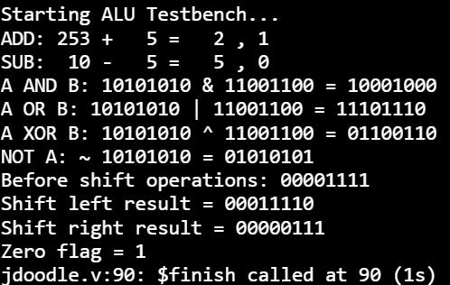

8-bit Verilog ALU

This project implements a simple 8-bit Arithmetic Logic Unit using Verilog HDL.

The ALU supports arithmetic, logic, and shift operations based on a 3-bit opcode input.

Features

* 8-bit addition
* 8-bit subtraction
* Bitwise AND
* Bitwise OR
* Bitwise XOR
* Bitwise NOT
* Shift left
* Shift right
* Zero flag
* Carry output

Operation Table

Opcode	Operation	Description
000	A + B	Addition
001	A - B	Subtraction
010	A & B	Bitwise AND
011	A | B	Bitwise OR
100	A ^ B	Bitwise XOR
101	~A	Bitwise NOT
110	A << 1	Shift left by 1
111	A >> 1	Shift right by 1

Project Structure

8-bit-verilog-alu/
├── src/
│   └── alu.v
├── tb/
│   └── alu_tb.v
└── README.md

How to Run

This project can be tested using an online Verilog simulator such as JDoodle.

Steps:

1. Open JDoodle Verilog Compiler.
2. Copy the ALU module from src/alu.v.
3. Copy the testbench from tb/alu_tb.v.
4. Paste both codes in the same editor.
5. Click Run.
6. The simulation output will appear in the output window.

## Simulation Output

Testbench

The testbench applies different values of A, B, and opcode to test all ALU operations.

Author

Created as a digital design project using Verilog HDL.
